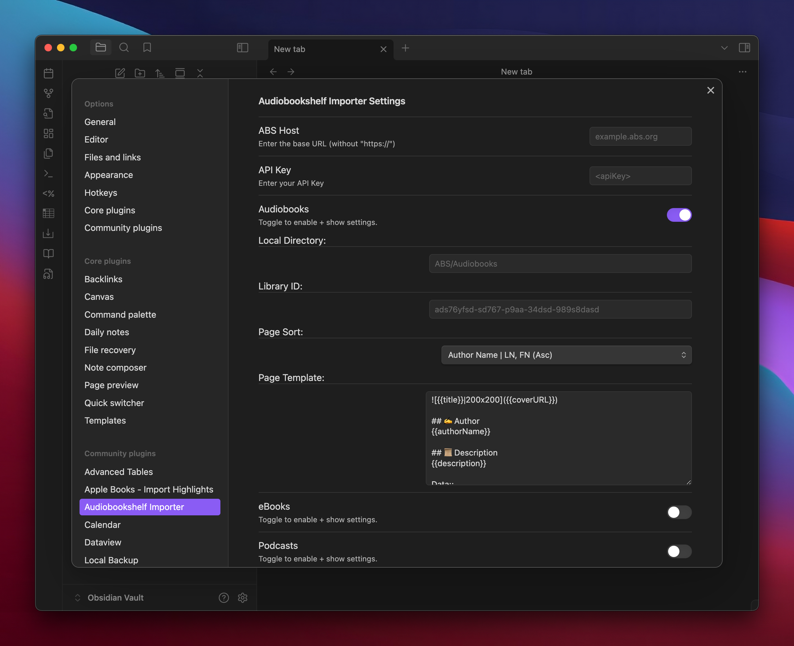

# Obsidian Audiobookshelf Importer

## \*\*This is a work in progress 😼\*\*

📖 **Obsidian Audiobookshelf Importer** is an Obsidian plugin that fetches audiobook metadata from **[Audiobookshelf](https://www.audiobookshelf.org/)** via its API and creates structured markdown notes in your Obsidian vault.

## 🚀 Features
✅ Fetches audiobook data from an **Audiobookshelf** instance  
✅ Uses **configurable settings** for API connection and file structure  
✅ Automatically **creates missing folders**  
✅ Supports **custom markdown templates** for new audiobook notes  
✅ Organizes notes under **`<settings.abDir>/<settings.sortBy>/<series?>/title.md`**  

---

## 🔧 Installation
1. **Download Repo + Extract**
   ```
   cd </path/to/repo>
   ```
2. **Create Obsidian Plugin folder**
   ```
   mkdir </path/to/obsidian/vault>/.obsidian/plugins/audiobookshelf-importer
   ```
3. **Copy Plugin Files to `audiobookshelf-importer`**:
   ```
   cp main.js manifest.json </path/to/obsidian/vault>/.obsidian/plugins/audiobookshelf-importer/.
   ```
3. **Restart Obsidian** and enable **Audiobookshelf Importer**.
4. **Configre Audiobookshelf Importer**.

---

| **Settings**   | **Description** | **Example**
|--------------|---------------|---|
| **`host`** | The base URL of your **Audiobookshelf** API (**exclude `https://`**). | `abs.example.org` |
| **`apiKey`** | Your **API token** for authentication. Find in `Settings > Users > <USER> > API Key` | `<token>` |
| **`*Enable`** | Toggle to enable + show settings. | [default: `false`] |
| **`*Dir`** | The **base directory** in Obsidian where notes will be stored, organized by `this.settings.*SortBy`, then by series. | `Books/ABS` |
| **`*Lib`** | The **library ID** used for fetching audiobooks. Extract only the unique identifier from the URL: `https://abs.ex.org/audiobookshelf/library/<id>`. | `ads76yfsd-sd767-p9aa-34dsd-989s8dasd` |
| **`*SortBy`** | `authorName` or `authorNameLF`. Used to determine how pages are created in folder structure. | [default: `authorNameLF`] |
| **`*Template`** | A Markdown **template** to apply to newly created notes. | [🔗 Markdown Template Example](#markdown-template-example) |



### 📁 File Structure
Audiobook notes are stored in:
```
<settings.*Dir>/<settings.*SortBy>/<series?>/title.md
```
🔹 **Example Folder Structure**:
```
Books/
├── ABS/
|   |
| sortBy: authorName
|   |
│   ├── Terry Goodkind/
│   │   ├── Sword of Truth/
│   │   |   ├── # | Wizards First Rule.md
│   │   |
│   │   ├── The Law of Nines.md
|   |
|   |
| sortBy: authorNameLF
|   |
│   ├── Goodkind, Terry/
│   │   ├── Sword of Truth/
│   │   |   ├── # | Wizards First Rule.md
│   │   |
│   │   ├── The Law of Nines.md
|   |
```

---

## Markdown Template Example
You can define your own **markdown template** using placeholders.


Example:
```


## ✍️ Author 
{{authorName}}

## 📜 Description
{{description}}

Data:: 
    ```
    {{jsonData}}
    ```

**Narrator:** {{narrator}}   
**Published:** {{publishedYear}}  
**Publisher:** {{publisher}}  

```

### 🔹 Supported Placeholders
- `{{authorName}}`
- `{{authorNameLF}}`
- `{{coverURL}}`
- `{{description}}`
- `{{jsonData}}`
- `{{narrator}}`
- `{{publishedDate}}`
- `{{publishedYear}}`
- `{{publisher}}` 
- `{{title}}`

---

## 🛠️ Usage
1. **Configure the plugin settings** in **Obsidian → Community Plugins → Obsidian Audiobookshelf Importer**.
2. **Run the fetch command** 

* From the Command Palette:  
   ```
   Fetch audiobooks from Audiobookshelf
   ```
* From the Sidebar:
   ```
   Click the audio-file icon in the ribbon labeled 'ABS'.
   ```
3. The plugin will:
   - Retrieve audiobook metadata from Audiobookshelf
   - Organize notes in the defined folder structure
   - Apply the markdown template
   - Create missing folders if they don’t exist

---

## 📜 License
MIT License. Feel free to modify and contribute! 😊

---

### 🚀 Future Improvements
- ✅ Add **automatic cover image download**
- ✅ Add **more metadata fields**
- ✅ Support **multiple libraries**
- ✅ Add **progress tracking for audiobooks**
